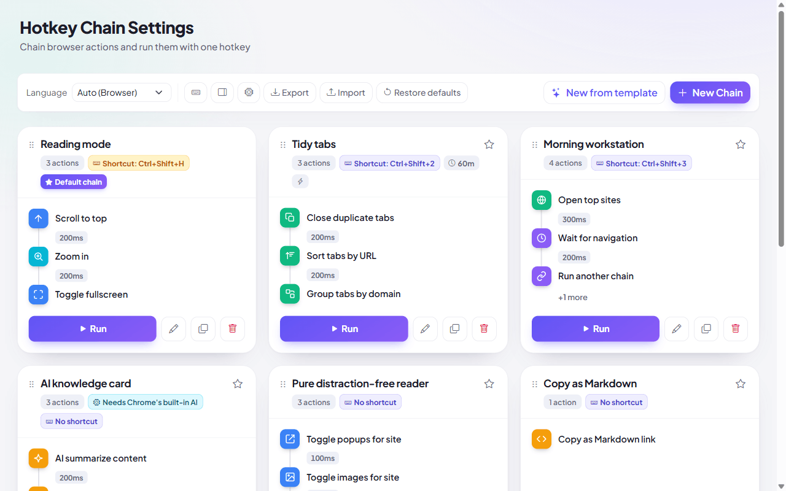

# 🔗 Hotkey Chain (Chrome Extension)

> Chain 103+ browser actions and run them by hotkey, side panel, address bar, right-click, schedule, or URL match

**English** · [简体中文](README.zh.md)

 

**[⬇ Install from the Chrome Web Store](https://chromewebstore.google.com/detail/hotkey-chain/kcinhmiihahdgckoonemglanjpggdldb)** · [load an unpacked build](#-installation)

Think of macOS/iOS Shortcuts, but living inside Chrome. Build a sequence once (a "chain"), then run it anywhere — with per-step delays, conditions, variables, and chains that call other chains.

## Table of Contents

- [Highlights](#-highlights)
- [Compatibility](#-compatibility)
- [Triggers](#-triggers)
- [Actions](#-actions)
- [Flow control & variables](#-flow-control--variables)
- [Curated Template Library (28 Presets)](#-curated-template-library-28-presets)
- [On-Device AI Requirements](#-on-device-ai-requirements)
- [Permissions & privacy](#-permissions--privacy)
- [Installation](#-installation)
- [Quick Start](#-quick-start)
- [Configuration](#️-configuration)
- [Internationalization](#-internationalization)

## 🧩 Compatibility

| Aspect | Supported |
| --- | --- |
| Browser | Chrome 116+, Edge 116+, and other Chromium browsers |
| Install | Chrome Web Store, or load `extension/` unpacked — no build step |
| Features needing newer Chrome | *Add to reading list* needs 120+ (falls back with a notice); *Save page as MHTML* needs 116+; *Side Panel companion* needs 114+; *On-Device AI (`LanguageModel` / Prompt API)* ships with Chrome — no flag needed, but it needs desktop Chrome and a capable GPU/CPU (see [below](#-on-device-ai-requirements)) |
| Where chains run | Any `http(s)` page. Browser pages (`chrome://`, the Web Store) block extension scripts, so page actions are skipped there |
| Data | Stays in your browser — no account, no sync, no server |

## ✨ Highlights

- **103+ actions**: across pages, tabs, windows, media, content, on-device AI, site content permissions, and browser automation
- **Built-in On-Device AI (Prompt API)**: summarize, explain, and translate selection or page content locally via Gemini Nano with zero data leakage; fully configurable target language (English, Chinese, Japanese, French, German, etc.) and format styles (concise, detailed, bullet points, casual, formal); chain cards feature distinct **Requires On-Device AI** badge indicators
- **System Speech Synthesis (TTS) & Pipeline**: native voice engine with adjustable speech rate (0.5x~2.0x), custom voice language, and direct consumption of upstream pipeline outputs
- **Workflow Automation Pipeline**: orchestrate multi-chain execution (`Chain A ➔ Chain B`) with automatic success transitions, failure fallback routes, and seamless context data piping (`{output}` / `{{output}}`)
- **Seven ways to trigger** a chain: hotkey, toolbar icon, side panel companion, right-click context menu, address bar (omnibox), scheduled timer, and URL & SPA auto-run
- **Dedicated Side Panel companion**: browse any webpage while triggering, inspecting, and monitoring chains with live AI dependency badges side-by-side
- **Site permissions & content controls**: toggle per-site JavaScript, images, and popups on the fly; wait for page navigation and single-page app (SPA) loading completion
- **Modern template gallery**: 28 categorized ready-to-run presets (AI knowledge card, workstation launch, dev reset pipeline, pure reader, focus sandbox, tab cleanup, …), including two that ship as a chain *pair* to show off pipeline orchestration and conditional branching
- **Visual editor**: build chains with grouped action pickers, per-step delays (ms), drag-and-drop ordering, and visual timeline previews
- **Backup & share**: export/import the whole config as JSON, or share a single chain as its own file
- **18 languages**: complete localization across English, 简体中文, 繁體中文, 日本語, 한국어, العربية, and 12 more, with automatic RTL layout for Arabic

## ⚡ Triggers

| Trigger | How |
| --- | --- |
| **Hotkey** | `Ctrl+Shift+H` runs the default chain; `Ctrl+Shift+1/2/3` run chains 1–3; chains 4–9 have bindable slots |
| **Toolbar icon** | Click to run the default chain; right-click for a menu of your chains |
| **Side panel** | Open the Hotkey Chain side panel companion to search and execute any chain with one click |
| **In-page right-click** | Run a chain from the page, a text selection, a link, an image, or media |
| **Address bar** | Type `hc` + space + a chain name to find and run it (omnibox) |
| **Schedule** | Run a chain every N minutes in the background (`chrome.alarms`) |
| **URL & SPA auto-run** | Run a chain automatically when a page loads or when single-page app routes change (GitHub, YouTube, Next.js) matching your URL patterns |

## 🎬 Actions

103+ actions across ten groups. The extension lists every one of them, in your language, under **Available actions** on the options page — this table outlines the core capabilities:

| Group | Features & Key Configurations |
| --- | --- |
| **Page** | Scroll, reload, back/forward, fullscreen, dark mode, design mode (in-place editing), toggle site JavaScript/images/popups, page translation (**configurable target language**), print, open a URL |
| **Tabs** | Close duplicates, sort by URL, group by domain, collapse/expand groups, mute, discard active/other tabs to free memory, reopen closed, open top workstation sites, move and switch |
| **Windows** | New window, close other windows, minimize, maximize, incognito, side panel companion, move/duplicate tab to its own window |
| **Media** | Play/pause, **play without pausing** (for use in combinations), playback speed, read selection aloud (**voice language, 0.5x~2.0x speech rate, prefer upstream pipeline output**), custom text TTS speech (**variable interpolation & direct pipeline data streaming**) |
| **Content & AI** | **On-device AI summarization** (configurable language and concise/detailed/bullet styles); **On-device AI deep explanation** (configurable language and style); **On-device AI translation** (multi-language and plain/markdown formatting); extract all links or images; search selection (**with prefer upstream pipeline output**); copy HTML/Markdown/URL/title/selection; bookmark; reading list |
| **Zoom** | Zoom in, zoom out, reset |
| **Flow control** | Condition branching (URL matching / selection checking), confirmation prompts (with confirm / cancel branches), wait for page navigation (configurable millisecond timeout), sub-chain execution (with data piping), delay waits |
| **Advanced** | Hard refresh, screenshot, save as MHTML, system notifications, clear cache, cookies, downloads, or site data, keep awake, extension options, shortcuts page, reload extension |
| **Extension control** | Enable/disable, uninstall, reload a dev build, open another extension's options or store page. This group is what the `management` permission is for — see [Permissions & privacy](#-permissions--privacy) |

## 🔀 Flow control & variables

A chain is not just a linear list — it is a versatile automation pipeline:

- **Conditions & Branching** — `Continue if URL matches` and `Continue if text is selected` evaluate conditions; failure stops the chain or immediately routes to a fallback chain
- **Interactive Confirmation** — `Ask to confirm` displays an elegant dialog directly on the page; clicking Continue advances execution, while Cancel can divert to a recovery chain
- **Workflow Pipeline Orchestration** — Seamlessly link chains sequentially (`Chain A ➔ Chain B`):
  - **Auto-advance on Success**: configure `nextChainId` to trigger the next chain automatically upon successful completion
  - **Fault-Tolerant Fallback**: configure `fallbackChainId` to catch errors or interruptions and route execution to a fallback chain
  - **Cross-Chain Data Streaming**: toggle `passOutput` so the output of one chain streams directly into the next
- **Context Data Piping** — Upstream action results (such as scraped links, AI summaries, or highlighted text) automatically flow down the execution pipeline:
  - Reference upstream results dynamically inside text fields using `{output}`, raw unescaped `{{output}}`, or `{prev.output}`
  - Speech actions (`speak_selection` / `speak_text`) and search selection (`search_selection`) include a **Prefer pipeline output** option to vocalize or search upstream output automatically (e.g. AI Summary ➔ Read Aloud)
- **Dynamic Variable Interpolation** — Freely use contextual variables in fields like *Open URL*, *Copy text*, *Ask to confirm*, and *Show notification*:
  - `{url}`: current tab full URL
  - `{title}`: current tab page title
  - `{selection}`: current highlighted text selection
  - `{clipboard}`: system clipboard contents
  - `{date}`: current date (e.g. `2026-09-18`)
  - `{time}`: current time (e.g. `14:30:00`)
  - `{output}` / `{{output}}`: piped output from previous steps or chains
- **Navigation Wait** — `Wait for page navigation` smartly pauses execution until page loading or single-page app (SPA) routing is complete
- **Sub-chain Execution** — `Run another chain` invokes modular chains as steps, guarded by recursion depth and circular loop protection
- **Visual Feedback** — the toolbar badge shows live step progress (`3/5`) while a chain runs, hovering it names the action being executed, and an in-page HUD shows which action is running right now plus how far along the chain is; errors surface a warning badge and a system notification

## 📚 Curated Template Library (28 Presets)

Hotkey Chain includes 28 pre-configured, production-ready workflow templates across 6 major productivity categories. Two of them ship as a **pair of chains** to demonstrate pipeline orchestration.

### 🤖 1. AI Intelligence & Assistance
- **AI Smart Page Summarizer**: extracts core page summaries locally via on-device AI and shows them in the side panel
- **AI Selection Deep Dive**: select any passage and have on-device AI explain it, with the notes kept in the side panel
- **AI Translate & Read Aloud**: translates the selection into the target language and reads it out with system TTS
- **AI Knowledge Card Clipper**: distils the key takeaways and formats them into a Markdown note card with source and date
- **Long-form Summary & Read-Aloud Pipeline**: summarizes the page, then *auto-advances to a second chain* that speaks the summary — the pipeline (`nextChainKey`) example

### 📑 2. Tab & Window Management
- **Tab Cleanup**: deduplicates tabs, sorts them by URL, and groups them by domain
- **Reclaim Memory & Organize Tabs**: also hibernates inactive tabs to free RAM, then collapses the groups
- **Close Other Tabs (confirm first)**: asks for confirmation before closing every other tab

### 📖 3. Deep Reading & Efficiency
- **Pure Distraction-Free Reader**: blocks popups, disables images, and switches to dark mode
- **Read Aloud**: reads the highlighted passage aloud with the native speech engine
- **Play Video & Fullscreen**: makes sure the page video is playing, then goes fullscreen

### 🛠️ 4. Frontend & Developer Tools
- **Frontend Dev Fast Reset Pipeline**: clears this site's storage, purges the browser cache, and hard-reloads
- **In-Place Webpage Editor**: enables `designMode` so you can edit the page copy and layout like a document
- **Extract Page Links & Images**: extracts every image URL *and* every hyperlink, then copies both as one structured list
- **Extract Links After Full Load**: reloads and waits for loading to truly finish (good for SPAs) before extracting

### 🛡️ 5. Privacy & Anti-Tracking
- **Privacy Quick Wipe**: asks for confirmation, then clears **all** cookies and the **entire** download history — every site, not just the current one
- **Script & Popup Shield**: turns off JavaScript execution for the current site and blocks its popups
- **Incognito Handoff & History Purge**: hands the current page off to an incognito window, closes the tab, and wipes its URL from history

### ⚡ 6. Automation & Workflows
- **Workstation Launch Pipeline**: opens your most-visited work sites, cleans duplicates, and organizes them into groups
- **Copy as Markdown Link**: formats the page title and URL into a Markdown link on the clipboard
- **Snapshot & Save**: captures the visible area and bookmarks the page
- **Wrap-up Mode**: bookmarks the page, mutes all audio, and minimizes the window
- **Side Panel Companion**: opens the side panel workspace alongside the page
- **Focus Mode**: mutes every tab, switches to dark mode, and enters fullscreen
- **Isolated Focus Workspace Sandbox**: moves the tab into its own maximized window and hibernates the rest
- **AI Extraction & Summarize Workflow**: extracts the links, summarizes them with on-device AI, and copies a Markdown digest
- **Read Later & Archiving Pipeline**: saves the page as clean Markdown and bookmarks it
- **Search the Selection (conditional)**: checks whether anything is selected; if not, a *second chain* tells you to select text — the branch (`elseChainKey`) example

## 🧠 On-Device AI Requirements

Hotkey Chain uses Google Chrome's built-in on-device AI (`LanguageModel` / Prompt API, powered by Gemini Nano):

- **Zero Cloud Data Transfer**: all prompts, selections, and page text are computed purely on your local hardware (NPU/GPU/CPU). After the one-time model download, no network request is made
- **No API Key, No Flags**: no subscription, no token, and nothing to enable in `chrome://flags` — the API ships with Chrome
- **Flexible Tuning**: configure target language (Auto-detect, English, Chinese, Japanese, etc.) and summarization/explanation styles (concise, detailed, casual, formal, etc.)
- **Visual AI Badges**: options cards and the side panel companion prominently display a **"Requires On-Device AI"** badge, and 22 of the 28 templates never touch AI at all
- **Hardware Requirements**: desktop Chrome only — Windows 10/11, macOS 13+, Linux, or Chromebook Plus (not Android/iOS); about 22 GB free on the profile drive; either over 4 GB VRAM, or 16 GB RAM with 4+ cores. The model downloads on first use — watch progress at `chrome://on-device-internals`
- **Honest Failure**: if the API is missing, the model is still downloading, or the hardware is unsupported, the action says which of those it is and stops the chain there — rather than failing silently and letting later steps build a card out of stale output
- **Check It Yourself**: the CPU icon in the options toolbar probes every context that could host the model — the extension page, the service worker, and both page worlds — and reports exactly what Chrome said in each, so you can confirm whether AI works on your machine rather than guessing

## 🔐 Permissions & privacy

The install prompt asks for a lot, because an action can only be offered if the permission behind it is granted. Here is what the broad ones are actually for:

| Permission | Needed by |
| --- | --- |
| `<all_urls>` + `scripting` + `activeTab` | Every action that runs *inside* a page: scroll, dark mode, translate, copy selection, read aloud. It has to work on whatever site you're on, so it can't be scoped to a list. |
| `management` | The **Extension control** actions — enable / disable / uninstall another extension, reload a dev build. Uninstall always asks for confirmation. |
| `browsingData` | *Clear browser cache* and *Clear this site's data*. |
| `history` | *Remove page from history*. |
| `clipboardRead` / `clipboardWrite` | The copy actions, and the `{clipboard}` variable. |
| `pageCapture` | *Save page as MHTML*. |
| `tabs` · `tabGroups` · `sessions` · `topSites` | Tab and window actions — sorting, grouping, reopening a closed tab, opening top work sites. |
| `bookmarks` · `readingList` · `downloads` · `search` | Bookmark, reading-list, download-folder, and search-selection actions. |
| `tts` · `notifications` · `alarms` · `power` | Read aloud, notifications, scheduled chains, keep-awake. |
| `webNavigation` · `contentSettings` | Single-Page App (SPA) route change auto-run, wait for page navigation, and per-site JavaScript/images/popups permission toggling. |
| `storage` · `contextMenus` · `sidePanel` | Your chains, right-click menu, and the side panel companion. |

**Nothing leaves your browser.** There is no analytics, no telemetry, and no backend — the only two `fetch` calls in the source read the extension's own bundled locale files via `chrome.runtime.getURL()`. Chains and settings live in `chrome.storage`; export/import is a local file you choose.

If you don't want to grant this much, load an unpacked build and delete the permissions you don't need from `extension/manifest.json` — the actions that depend on them will fail, everything else keeps working.

## 📦 Installation

**[From the Chrome Web Store](https://chromewebstore.google.com/detail/hotkey-chain/kcinhmiihahdgckoonemglanjpggdldb)** — one click, auto-updates. This is all most people need.

To run it from source instead (to modify it, or to trim permissions):

1. Clone or download this repository
2. Open `chrome://extensions` and enable **Developer mode**
3. Click **Load unpacked** and select the **`extension`** folder (the one with `manifest.json` directly inside)
4. The 🔗 icon appears in the toolbar

Customize keyboard shortcuts at `chrome://extensions/shortcuts` (the keyboard icon in the options toolbar jumps straight there).

Working on the extension — tests, packaging, releasing, brand assets — is in [CONTRIBUTING.md](CONTRIBUTING.md).

## 🚀 Quick Start

1. Click the 🔗 icon to run the default chain, or right-click it for the chain menu
2. Open **Options** to manage chains — start from a template, or build your own
3. In a chain: add actions, set per-step delays, drag to reorder, then bind a hotkey or trigger
4. Hit **Test Run** to try it on the current tab

## 🛠️ Configuration

- The options page is a visual editor: grouped action pickers, per-step delays (ms), and drag-and-drop ordering. Each chain card previews its first three steps as a timeline, with the delay shown on the connector between them
- The toolbar splits by weight: library operations (language, shortcuts, side panel, AI status check, export, import, restore) on the left, the two actions that create something on the right
- Each chain can carry its own triggers — a schedule interval and URL auto-run patterns
- **Execute command** lists the commands of any extension (including this one); **Call extension** sends a structured message (template or custom JSON)
- Chains and their order are stored in `chrome.storage.local`
- The toolbar's **Export/Import** buttons back up or restore the whole config as JSON; **Export this chain** (in the editor) shares one chain as a file

## 🌍 Internationalization

- **18 languages**: English, 简体中文, 繁體中文, 日本語, 한국어, Español, Français, Deutsch, Português (Brasil), Русский, Italiano, العربية, हिन्दी, Bahasa Indonesia, Türkçe, Tiếng Việt, ไทย, Polski — default follows the browser
- The options page has a language selector that overrides the entire extension — background, menus, notifications, and commands; right-to-left layout is applied automatically for Arabic
- Locale files live in `extension/_locales/<code>/messages.json` (e.g. `en`, `zh_CN`, `ja`, `ar`), 537+ keys each — `npm test` fails if any locale drifts out of sync
- Chrome's i18n has no plural rules, so counts that vary use a pair of keys (`actions_count_one` / `actions_count`); languages without a plural distinction simply repeat the same string

## About the 365 Open Source Plan

Project **#014** of the [365 Open Source Plan](https://github.com/rockbenben/365opensource) — one person + AI, 300+ open-source projects in a year.

[Submit your idea →](https://365.aishort.top/) · [Discord](https://discord.gg/PZTQfJ4GjX) · [Telegram](https://t.me/aishort_top)
