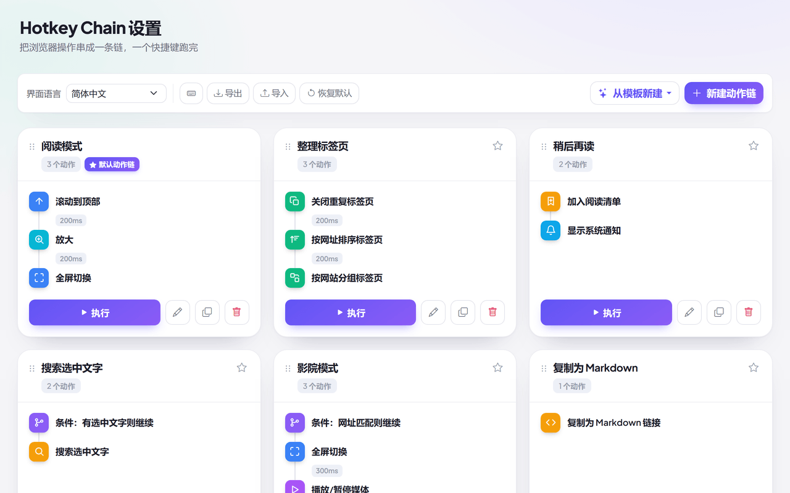

# 🔗 Hotkey Chain（Chrome 扩展）

> 把 103+ 个浏览器动作编排成动作链，用快捷键、侧边栏、地址栏、右键、定时或网址匹配触发

[English](README.md) · **简体中文**

 

**[⬇ 从 Chrome 应用商店安装](https://chromewebstore.google.com/detail/hotkey-chain/kcinhmiihahdgckoonemglanjpggdldb)** · [加载解压后的扩展](#-安装)

就像 macOS / iOS 的「快捷指令」，但活在 Chrome 里。动作序列只需配置一次，之后随处触发，并支持逐步延迟、条件判断、变量，以及链调用链。

## 目录

- [核心亮点](#-核心亮点)
- [支持范围](#-支持范围)
- [触发方式](#-触发方式)
- [支持的动作](#-支持的动作)
- [流程控制与变量](#-流程控制与变量)
- [精选模板库（28 款）](#-精选模板库28-款)
- [端侧 AI 支持说明](#-端侧-ai-支持说明)
- [权限与隐私](#-权限与隐私)
- [安装](#-安装)
- [快速上手](#-快速上手)
- [使用与配置](#️-使用与配置)
- [国际化](#-国际化)

## 🧩 支持范围

| 方面 | 支持情况 |
| --- | --- |
| 浏览器 | Chrome 116+、Edge 116+，以及其它 Chromium 内核浏览器 |
| 安装方式 | Chrome 应用商店，或以开发者模式加载 `extension/` 目录——没有构建步骤 |
| 需更高版本的功能 | 「加入阅读清单」需 Chrome 120+（低版本提示降级）；「保存为 MHTML」需 116+；「侧边栏伴侣」需 Chrome 114+；「端侧 AI（`LanguageModel` / Prompt API）」随 Chrome 提供、无需开 flag，但需要桌面版 Chrome 且有足够的显存/内存（见[下方说明](#-端侧-ai-支持说明)） |
| 动作生效范围 | 所有 `http(s)` 页面。浏览器内置页（`chrome://`、应用商店）禁止扩展注入脚本，页面类动作在那里会被跳过 |
| 数据 | 全部留在你的浏览器里——无账号、无同步、无服务端 |

## ✨ 核心亮点

- **103+ 个动作**：覆盖页面、标签、窗口、媒体、内容、设备端 AI、站点权限，以及浏览器自动化
- **内置端侧 AI (Prompt API)**：纯本地运行 AI 总结、深度解释与智能翻译，零数据上云与泄露；支持配置输出语言（中/英/日/法/德等）与文本风格（简明/详细/要点/通俗/严谨等）；UI 带有醒目的「需浏览器内置 AI」专属徽章
- **语音朗读 (TTS) 与数据管道**：系统级语音引擎，支持发音语言、0.5x~2.0x 语速微调，可直接朗读前序步骤的提取文本或 AI 总结结果
- **工作流流水线 (Pipeline)**：链与链无缝串联（`Chain A ➔ Chain B`），支持成功跳转、故障恢复备用分支与上下文数据 (`{output}` / `{{output}}`) 深度直通
- **七类触发方式**：快捷键、图标、侧边栏伴侣、右键菜单、地址栏 (omnibox)、定时运行、网址与 SPA 路由自动匹配
- **专属侧边栏伴侣**：浏览任意网页时，在侧边栏一键搜索、执行动作链与查看 AI 依赖标记
- **站点权限与内容控制**：随时一键切换当前网站的 JavaScript、图片加载、弹窗权限；智能等待页面导航与 SPA 加载完成
- **现代化模板库**：28 款开箱即用的分类模板（AI 知识卡片、工作台启航、开发重置、纯净阅读、专注沙盒、标签大扫除……），其中两款以**双链成对**下发，用来演示流水线编排与条件分支
- **可视化编辑器**：分组动作选择器、逐步毫秒级延迟、拖拽排序、时间轴即时预览 —— 边改边存并在标题栏给出回执，删除类操作留了撤销
- **跟随系统主题**：设置页与侧边栏随系统一起转深，不用去扩展里找开关
- **备份与分享**：整份配置一键导入/导出 JSON，或把单条链导出为独立分享文件
- **18 种语言**：完整本地化，支持 English、简体中文、繁體中文、日本語、한국어、العربية 等 18 种语言，支持阿拉伯语 RTL 布局

## ⚡ 触发方式

| 触发方式 | 说明 |
| --- | --- |
| **快捷键** | `Ctrl+Shift+H` 运行默认链；`Ctrl+Shift+1/2/3` 运行链 1–3；链 4–9 提供可绑定槽位 |
| **工具栏图标** | 点击运行默认链；右键弹出你的动作链菜单 |
| **侧边栏** | 打开 Hotkey Chain 侧边栏，边浏览网页边一键查找并触发动作链 |
| **页面右键菜单** | 在页面、选中文字、链接、图片或媒体上直接运行链 |
| **地址栏** | 输入 `hc` + 空格 + 链名称即可查找并运行（omnibox） |
| **定时** | 每 N 分钟在后台运行一条链（`chrome.alarms`） |
| **网址与 SPA 路由自动运行** | 页面加载完成或单页应用（GitHub、YouTube、Next.js 等）路由切换且网址匹配规则时自动运行（带防循环冷却） |

## 🎬 支持的动作

103+ 个动作，分十组。扩展的选项页里有一份「可用动作」速查，按你的界面语言完整列出每一个；下表列出核心概览：

| 分组 | 包含功能与核心配置 |
| --- | --- |
| **执行命令** | 触发一个已注册的扩展命令：自己这条 `_execute_action` 或 `execute_chain_N`，或按扩展 ID + 命令名触发别家扩展的命令 |
| **页面** | 滚动、刷新、前进后退、全屏、深色模式、实时编辑（Design Mode）、当前站点 JS/图片/弹窗权限开/关、网页翻译（**支持配置目标语言**）、打印、打开网址 |
| **标签** | 关闭重复、按网址排序、按域名分组、折叠/展开所有分组、静音、当前/其他标签休眠释放内存、重开已关闭、打开常用工作台站点、移动与切换 |
| **窗口** | 新建窗口、关闭其他窗口、最小化、最大化、无痕窗口、侧边栏、标签移到独立窗口/新窗口复制 |
| **媒体** | 播放/暂停、**仅播放（不暂停，供组合动作使用）**、播放速度、朗读选中文字（**支持发音语言、0.5x~2.0x 语速、优先消费流水线输出**）、自定义文本 TTS 朗读（**支持变量插值与流水线输出直通**） |
| **内容与 AI** | **端侧 AI 智能总结**（支持配置输出语言与简明/详细/要点等风格）；**端侧 AI 深度解释**（支持设定语言与风格）；**端侧 AI 智能翻译**（支持中/英/日/法/德等多语言及排版格式）；提取页面全部链接或图片；划词搜索（**支持优先搜索流水线输出**）；复制 HTML/Markdown/URL/标题/选中文字；加书签；加入阅读清单 |
| **缩放** | 放大、缩小、重置 |
| **流程控制** | 条件判断（网址匹配/选中文本判断）、询问确认（支持确认/取消跳转分支）、等待页面导航完成（毫秒超时）、子链调用（支持上下文数据直通）、等待延时 |
| **高级** | 硬刷新、截图、保存为 MHTML、系统通知、清除缓存、Cookie、下载记录或本站数据、保持唤醒、打开设置、快捷键管理、重载扩展 |
| **扩展管理** | 启用/停用、卸载、重载开发版、打开其它扩展的选项页或商店页。这一组正是 `management` 权限的用途，详见[权限与隐私](#-权限与隐私) |

## 🔀 流程控制与变量

一条链不只是固定列表，更是一个强大的自动化流程：

- **条件与分支** — 「网址匹配才继续」「有选中文字才继续」，条件不满足时提前停止或分支跳转至备用链
- **交互确认** — 「询问确认后继续」在页面上弹出优雅对话框，点击「继续」执行后续动作，点击「取消」可分支跳转至备选失败处理链
- **流水线编排 (Workflow Pipeline)** — 动作链支持无缝串联（`Chain A ➔ Chain B`）：
  - **成功后自动流转**：配置 `nextChainId`，当前链成功完成后自动执行下一条链
  - **故障恢复兜底**：配置 `fallbackChainId`，当前链中断或发生错误时自动执行故障备选链
  - **数据跨链流转**：开启 `passOutput`，上一条链的最终结果无缝流入下一条链
- **上下文数据传递** — 前置动作生成的数据（如提取的外链列表、AI 总结要点、划选文本等）自动流转至流水线：
  - 在动作输入框中使用 `{output}`、无转义原始文本 `{{output}}` 或 `{prev.output}` 动态引用前序步骤输出
  - 朗读动作（`speak_selection` / `speak_text`）和划词搜索（`search_selection`）支持 **优先消费流水线输出** 开关，实现「AI 提炼 ➔ 自动语音朗读」或「提取关键词 ➔ 自动搜索」
- **动态变量插值** — 在「打开网址」「按格式复制文字」「询问确认」「显示通知」等输入框中随心使用：
  - `{url}`：当前标签页完整网址
  - `{title}`：当前标签页标题
  - `{selection}`：当前划选的文本内容
  - `{clipboard}`：系统剪贴板内容
  - `{date}`：当前日期（如 `2026-09-18`）
  - `{time}`：当前时间（如 `14:30:00`）
  - `{output}` / `{{output}}`：前序动作或前序链的输出内容
- **导航等待** — 「等待页面加载/导航完成」智能暂停流水线，直至新网址或单页应用 (SPA) 路由加载完毕再继续执行下一步
- **子链调用** — 「运行另一条链」把独立链作为动作步骤复用，具备防无限递归与循环调用安全守卫
- **运行反馈** — 执行时工具栏徽章实时显示 `当前步/总步`，悬停徽章说明正在执行哪个动作；页面左下角的 HUD 显示当前动作与进度，并带**停止**按钮，长链可以就地叫停；遇到错误即时弹出警告徽章与系统通知

## 📚 精选模板库（28 款）

Hotkey Chain 内置了 28 款精心编排的开箱即用模板，覆盖 6 大高频使用场景，助你秒级搭建强大工作流。其中两款以**双链成对**下发，用来演示流水线编排与条件分支。

### 🤖 1. AI 智能与辅助
- **AI 智能页面速读**：使用端侧 Gemini Nano AI 提取网页核心摘要，并在侧边栏中整理展示
- **AI 划词深度解析**：选中网页段落，呼叫端侧 AI 进行逐段答疑解析并在侧边栏记录
- **AI 选区翻译与朗读**：通过端侧 AI 将划选文本翻译为目标语言，并调用系统语音引擎朗读
- **AI 知识卡片速记**：使用端侧 AI 提炼网页或划选内容的核心要点，格式化为 Markdown 引用卡片存入剪贴板
- **长文提炼与朗读流水线**：端侧 AI 提炼正文摘要，完成后**自动流转到第二条链**，用系统语音朗读出来 —— 流水线编排（`nextChainKey`）示例

### 📑 2. 标签与窗口管理
- **标签大扫除**：清理重复标签页，按网址排序并按域名自动归类分组
- **内存暴降与标签整理**：在去重排序的基础上，再休眠冻结非活跃标签释放内存，并折叠分组
- **关闭其他标签页（先确认）**：关闭其他所有标签页前先弹窗二次确认，避免误触丢失工作

### 📖 3. 深度阅读与提效
- **纯净无扰阅读**：拦截弹窗并屏蔽图片加载，开启深色模式享受极致沉浸式纯文本阅读
- **朗读选中内容**：调用浏览器原生语音合成引擎朗读当前高亮选中的文章段落
- **视频播放与全屏**：确保页面视频处于播放状态，再切入全屏获得无干扰的观影体验

### 🛠️ 4. 前端与开发者工具
- **前端开发极速重置流水线**：一键清除当前站点存储数据、清空浏览器缓存并强制硬刷新，前端调试零缓存干扰
- **网页原地自由编辑**：切换页面 DesignMode，支持像 Word 一样任意修改网页文字与布局用于排版截图
- **页面链接与图片提取**：从当前页面一键解析出全部媒体图片与链接，并合并成一份结构化清单复制
- **加载完成后提取链接**：刷新页面并等待加载真正完成（适合单页应用），再提取全部外链并复制

### 🛡️ 5. 隐私清理与防追踪
- **隐私数据极速抹除**：经弹窗确认后，清除**全部站点**的 Cookie 与**完整**下载记录 —— 不只是当前站点
- **极客脚本与弹窗防护**：一键关闭当前站点的 JavaScript 执行权限并拦截弹窗，抵御恶意脚本追踪
- **无痕隐身交接与痕迹抹除**：把当前网页交给无痕窗口继续浏览，关闭原标签并从历史记录中抹除访问足迹

### ⚡ 6. 自动化与流水线
- **常访工作台启航流水线**：批量在后台打开常用工作台站点，自动整理去重并按域名归类分组
- **Markdown 引用链接复制**：快速提取当前网页标题与网址，按 Markdown 标准格式拷贝到剪贴板
- **截图存档**：截取可见区域图像，同时将页面添加至书签栏备忘
- **收工模式**：保存书签防丢失，静音所有声音并最小化窗口准备下班
- **侧边栏效率助手**：一键呼出 Hotkey Chain 侧边栏伴侣，随时执行快捷链与管理配置
- **专注模式**：一键静音所有标签页、切换深色保护眼睛并进入全屏专注
- **独占任务专注沙盒**：将当前标签页移至全新独立窗口并最大化，同时冻结休眠原窗口其余标签释放内存
- **AI 提取与总结工作流**：自动提取网页链接并由端侧 AI 智能总结要点，格式化写入剪贴板
- **稍后读与正文归档流水线**：将当前网页提取为干净的 Markdown 存入剪贴板，同时加入书签备忘
- **划词即搜（条件分支）**：先判断页面上有没有选中文字，有就搜索；没有则由**第二条链**提示你先划词 —— 条件分支（`elseChainKey`）示例

## 🧠 端侧 AI 支持说明

Hotkey Chain 使用 Google Chrome 原生的端侧大模型能力（`LanguageModel` / Prompt API，由 Gemini Nano 驱动）：

- **零数据上云**：所有提示词与网页内容完全在本地设备（NPU/GPU/CPU）计算。模型首次下载完成后，不再发起任何网络请求
- **免 API Key、免开 flag**：无需订阅、无需 token，也不需要在 `chrome://flags` 里做任何设置 —— 该 API 随 Chrome 一起提供
- **灵活参数调节**：支持自由配置目标语言（自动检测、中文、英文、日文等）与总结/解释风格（简明要点、详细深度、通俗易懂等）
- **视觉感知提醒**：选项页卡片与侧边栏伴侣均带有醒目的 **「需浏览器内置 AI」** 徽章；28 款模板中有 22 款完全不依赖 AI
- **硬件要求**：仅桌面版 Chrome —— Windows 10/11、macOS 13+、Linux 或 Chromebook Plus（不支持 Android / iOS）；配置文件所在磁盘约 22 GB 可用空间；显存 >4 GB，或 16 GB 内存 + 4 核以上。模型首次使用时才下载，进度见 `chrome://on-device-internals`
- **如实反馈**：API 缺失、模型仍在下载、或硬件不支持时，会明确告知是哪一种情况**并在此中止链**——不会静默跳过、让后续步骤拿上一步的产物拼出一张假卡片
- **自己验证**：选项页工具栏的 CPU 图标会把所有可能承载模型的上下文都探一遍 —— 扩展页面、后台 service worker、以及页面隔离世界与主世界 —— 并原样报出 Chrome 在每个上下文里给出的值。想知道自己的机器上 AI 到底能不能用，看这个就够了，不用猜

## 🔐 权限与隐私

安装时索要的权限不少，因为一个动作要能提供，背后的权限就得先拿到。范围最大的那几项分别是给谁用的：

| 权限 | 谁在用 |
| --- | --- |
| `<all_urls>` + `scripting` + `activeTab` | 所有在**页面内**执行的动作：滚动、暗色模式、翻译、复制选中、朗读。你在哪个网站就得在哪生效，没法限定白名单。 |
| `management` | **扩展控制**类动作 —— 启用 / 停用 / 卸载其他扩展、重载开发版。卸载一定会二次确认。 |
| `browsingData` | 「清除浏览器缓存」「清除本站数据」。 |
| `history` | 「从历史记录中删除本页」。 |
| `clipboardRead` / `clipboardWrite` | 各类复制动作，以及 `{clipboard}` 变量。 |
| `pageCapture` | 「保存页面为 MHTML」。 |
| `tabs` · `tabGroups` · `sessions` · `topSites` | 标签页与窗口动作 —— 排序、按域名分组、恢复关闭的标签、打开常用常访工作台。 |
| `bookmarks` · `readingList` · `downloads` · `search` | 书签、稍后读、下载目录、搜索选中文字。 |
| `tts` · `notifications` · `alarms` · `power` | 朗读、系统通知、定时链、保持唤醒。 |
| `webNavigation` · `contentSettings` | 单页应用 (SPA) 路由监听自动运行、等待页面导航完成、当前站点 JavaScript/图片/弹窗权限开/关。 |
| `storage` · `contextMenus` · `sidePanel` | 存放你的链，以及右键菜单、侧边栏伴侣面板。 |

**没有任何数据离开你的浏览器。** 无统计、无遥测、无后端 —— 源码里仅有的两处 `fetch` 都是用 `chrome.runtime.getURL()` 读扩展自带的语言包。链与设置存在 `chrome.storage`，导出 / 导入是你自己选的本地文件。

不想给这么多权限的话，可以用开发者模式加载解压版，把 `extension/manifest.json` 里不需要的权限删掉 —— 依赖它们的动作会失效，其余照常可用。

## 📦 安装

**[从 Chrome 应用商店安装](https://chromewebstore.google.com/detail/hotkey-chain/kcinhmiihahdgckoonemglanjpggdldb)** —— 一键装好、自动更新，绝大多数人用这个就够。

想改代码、或想精简权限的话，从源码运行：

1. 克隆或下载本仓库
2. 打开 `chrome://extensions` 并启用**开发者模式**
3. 点击**加载已解压的扩展程序**，选择 **`extension`** 文件夹（里面直接就是 `manifest.json`）
4. 工具栏出现 🔗 图标

在 `chrome://extensions/shortcuts` 自定义快捷键（选项页工具栏的键盘图标可直达）。

想改代码、跑测试、打包发布或换素材，见 [CONTRIBUTING.zh.md](CONTRIBUTING.zh.md)。

## 🚀 快速上手

1. 点击 🔗 图标运行默认链，或右键打开动作链菜单
2. 打开**选项**管理动作链——从模板开始，或自己搭建
3. 在链中：添加动作、设置逐步延迟、拖拽排序，再绑定快捷键或触发器
4. 点击**试运行**在当前标签页试运行

## 🛠️ 使用与配置

- 选项页是可视化编辑器：分组动作选择、逐步延迟（毫秒）、拖拽排序。每张链卡片把前三步渲染成一条时间轴，延迟显示在两步之间的连接线上
- 工具栏按分量分区：左侧是库操作（语言、快捷键、侧边栏、AI 状态检测、导出、导入、恢复默认），右侧只放两个「会创建东西」的主操作
- 每条链可携带自己的触发器——定时间隔与网址自动运行规则
- **执行命令** 列出任意扩展（含本扩展）的命令；**调用扩展** 发送结构化消息（模板或自定义 JSON）
- 动作链与顺序存储在 `chrome.storage.local`
- 工具栏的**导出/导入**按钮可备份或恢复整份配置；编辑器中的**导出此链**把单条链分享为文件

## 🌍 国际化

- **18 种语言**：English、简体中文、繁體中文、日本語、한국어、Español、Français、Deutsch、Português (Brasil)、Русский、Italiano、العربية、हिन्दी、Bahasa Indonesia、Türkçe、Tiếng Việt、ไทย、Polski——默认跟随浏览器
- 选项页提供语言选择器，覆盖整套扩展——后台、菜单、通知、命令；阿拉伯语自动启用从右到左（RTL）布局
- 语言文件位于 `extension/_locales/<code>/messages.json`（如 `en`、`zh_CN`、`ja`、`ar`），每种语言 555+ 条 key —— 任何一种语言漂移，`npm test` 就会失败
- Chrome 的 i18n 没有复数规则，所以随数量变化的文案用一对 key（`actions_count_one` / `actions_count`）；无复数变化的语言两条写成一样即可

## 关于 365 开源计划

[365 开源计划](https://github.com/rockbenben/365opensource) 的第 **#014** 个项目——一个人 + AI，一年 300+ 个开源项目。

[提交你的需求 →](https://365.aishort.top/) · [Discord](https://discord.gg/PZTQfJ4GjX) · [Telegram](https://t.me/aishort_top)
